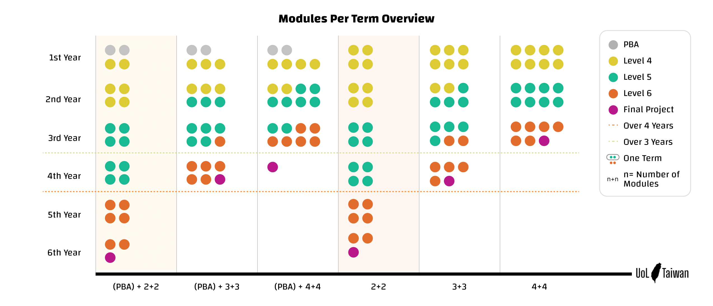

## 課程晉級規章

> Progression Rule，根據<[2021-2022 Programme Regulation](https://www.london.ac.uk/sites/default/files/regulations/progregs-cs-22-23.pdf)> p. 16-17

### PBA 過關標準

- ITP1 以及 其一數學課 (DM 若 10 月入學，CM 若 4 月入學) 期中作業成績超過 50%

### Level 4 到 Level 5

- 得到包含 ITP1 和 DM/CM 在內的 45 學分 (3 堂課拿到最終成績且及格)

- 正在上(或已完成)的包含 ITP2 在內的 30 學分 (2 堂課剛結束期末)

- 註冊其餘 Level 4 課程 (撇除沒有在當學期開放的課程)

### Level 5 到 Level 6

- 得到包含 OOP/SDD 在內的 45 學分 (3 堂課拿到最終成績且及格)

- 正在上(或已完成)的包含 OOP/SDD 在內的 45 學分 (3 堂課剛結束期末)

- 註冊其餘 Level 5 課程

### Final Project

> Final Project 是30 學分，計算每學期最高 60 學分的時候要算對

- 得到所有 Level 4 以及 Level 5 課程的學分 (或 每堂被當的課都達到三次重修上限失敗了)

- 剛上完 60 學分的 Level 6

## 配速提醒 Module Selection/Pacing

[特別感謝Chris的製作] [點擊圖片可放大檢視]

> 此圖不考量任何 RPL 申請 且 假定選課過程皆符合上述 progression rule

**學制設計嚴格意義說起來，你可以在 6 年內以每學期 2 堂課的速度完成，如同圖中顏色區塊所示，但是非常不建議如此，原因如下:**

- 要考量到生活變化，是否會突然工作變忙，家裡有事，人生有巨變等等的，適時預留彈性

- 要考量到萬一有課程被當，要重修的風險

- 最後最重要的就是! 兩堂 L5 跟兩堂 L6 的課業量是兩堂 L4 的不知道多少倍，成績占比也分別是 3 跟 5 倍。如果你在 L4 只能上 2 堂課，無論是因為時間還是能力受限，到了 L5 就算能勉強撐過，L6 是肯定沒辦法的

最後一個對所有人的提醒，不管你的配速，你哪學期把 Level 5 拿完(且沒有剩餘被當的 Level 4)，根據目前的規章，最快是一年後的那個學期可以拿 Final Project，所以請在規劃時想著整體。
