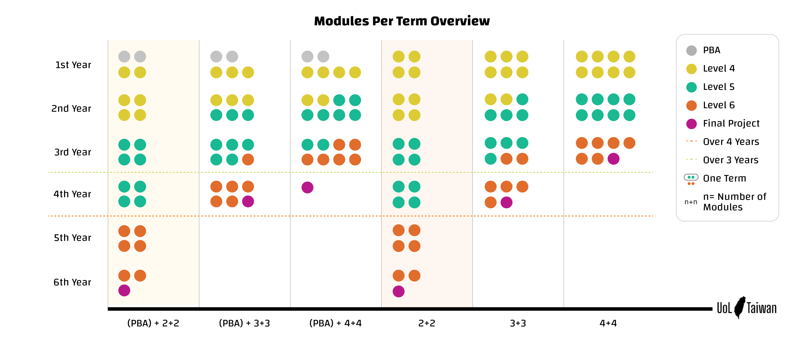

## 課程晉級規章

> Progression Rule，根據<[2021-2022 Programme Regulation](https://london.ac.uk/sites/default/files/regulations/progregs-bsc-computer-science-2021-22.pdf)> p. 15-17

### PBA 過關標準

- ITP1 以及 其一數學課 (DM若10月入學，CM若4月入學) 期中作業成績超過50%

### Level 4 到 Level 5

- 得到包含ITP1和DM/CM在內的45學分 (3堂課拿到最終成績且及格)

- 正在上(或已完成)的包含ITP2在內的30學分 (2堂課剛結束期末)

- 註冊其餘Level 4課程 (撇除沒有在當學期開放的課程)

### Level 5 到 Level 6

- 得到包含OOP/SDD在內的45學分 (3堂課拿到最終成績且及格)

- 正在上(或已完成)的包含OOP/SDD在內的45學分 (3堂課剛結束期末)

- 註冊其餘Level 5課程

### Final Project

> Final Project是30學分，計算每學期最高60學分的時候要算對

- 得到所有Level 4以及Level 5課程的學分 (或 每堂被當的課都達到三次重修上限失敗了)

- 剛上完60學分的Level 6

## module selection 配速提醒

[特別感謝Chris的製作] [點擊圖片可放大檢視]

> 此圖不考量任何RPL申請 且 假定選課過程皆符合上述progression rule

**學制設計嚴格意義說起來，你可以在6年內以每學期2堂課的速度完成，如同圖中顏色區塊所示，但是非常不建議如此，原因如下:**

- 要考量到生活變化，是否會突然工作變忙，家裡有事，人生有巨變等等的，適時預留彈性

- 要考量到萬一有課程被當，要重修的風險

- 最後最重要的就是! 兩堂L5跟兩堂L6的課業量是兩堂L4的不知道多少倍，成績占比也分別是3跟5倍。如果你在L4只能上2堂課，無論是因為時間還是能力受限，到了L5就算能勉強撐過，L6是肯定沒辦法的

最後一個對所有人的提醒，不管你的配速，你哪學期把Level 5拿完(且沒有剩餘被當的Level 4)，根據目前的規章，最快是一年後的那個學期可以拿Final Project，所以請在規劃時想著整體。