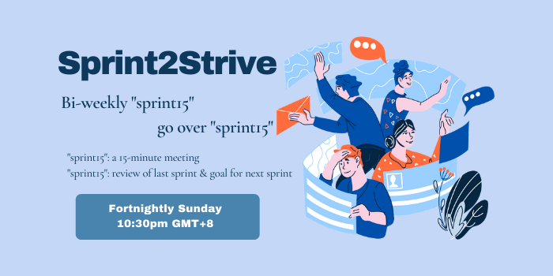

### 😶‍🌫️ GitHub & VSC 的結合運用

一直想知道怎麼使用GitHub但是看到一堆指令就想放棄嗎?

不知道到底GitHub對你寫程式有什麼幫助嗎?

想開始學但是不知從何下手 想要有人帶嗎?

<a href="https://uol-taiwan.github.io/resource-hub/activity/github-vsc.html">進入閱讀詳情 讓我們知道你有興趣參加這個工作坊!</a>

### 🤓 督促機制 5/1 上路

 > Click to see more info < 

### 🤔 選課須知

 > 點擊圖片進入說明頁面 < 

### 🤩 UoL Taiwan 新手入村須知

[For New Students](https://uol-taiwan.github.io/resource-hub/For%20New%20Students.html)
